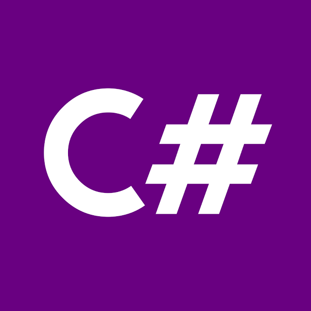

<h1 style="display: inline_block">Vladimir Carlos Alves<h1>

:computer: Desenvolvedora de Sistemas FullStack 

     
    

 

    

 
 <h2 style="display: inline_block">Ferramentas que uso:</h2> 
 
  
    
    
    

 
 <h2 style="display: inline_block">Linguagem que tenho conhecimento:</h2> 
 
 
    
 Microsoft C#

    
 Microsoft Visual Basic 6

    
 JavaScript

    
 TypeScript

    
 Python

 

  
