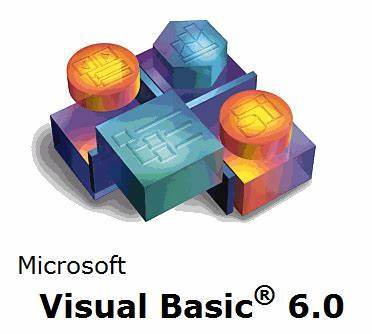

# Vladimir Carlos Alves
Analista Desenvolvedor de Sistemas FullStack

    <h3 style="text-decoration: underline" >Formação</h3>
    
 Graduação: Bacharel em Sistema de Informação 07/2010 -> 06/2014

    
 Pós Graduação em Inteligência Artificial e Machine Learning 11/2023 -> 09/2024

    
 Pós Graduação em Engenharia da Automação e IoT 01/2024 -> 11/2024

 

     
    

 

    

 
 <h2 style="display: inline_block">Ferramentas que uso:</h2> 
 
  
    
    
    

 
 <h2 style="display: inline_block">Linguagem de Programação:</h2> 
 
  
    
 Microsoft C#

    
 Microsoft Visual Basic 6

    
 JavaScript

    
 TypeScript

    
 Python

 

  
<h2 style="display: inline_block">Banco de Dados:</h2> 
 
  
    
    
    
    
    
 

  
